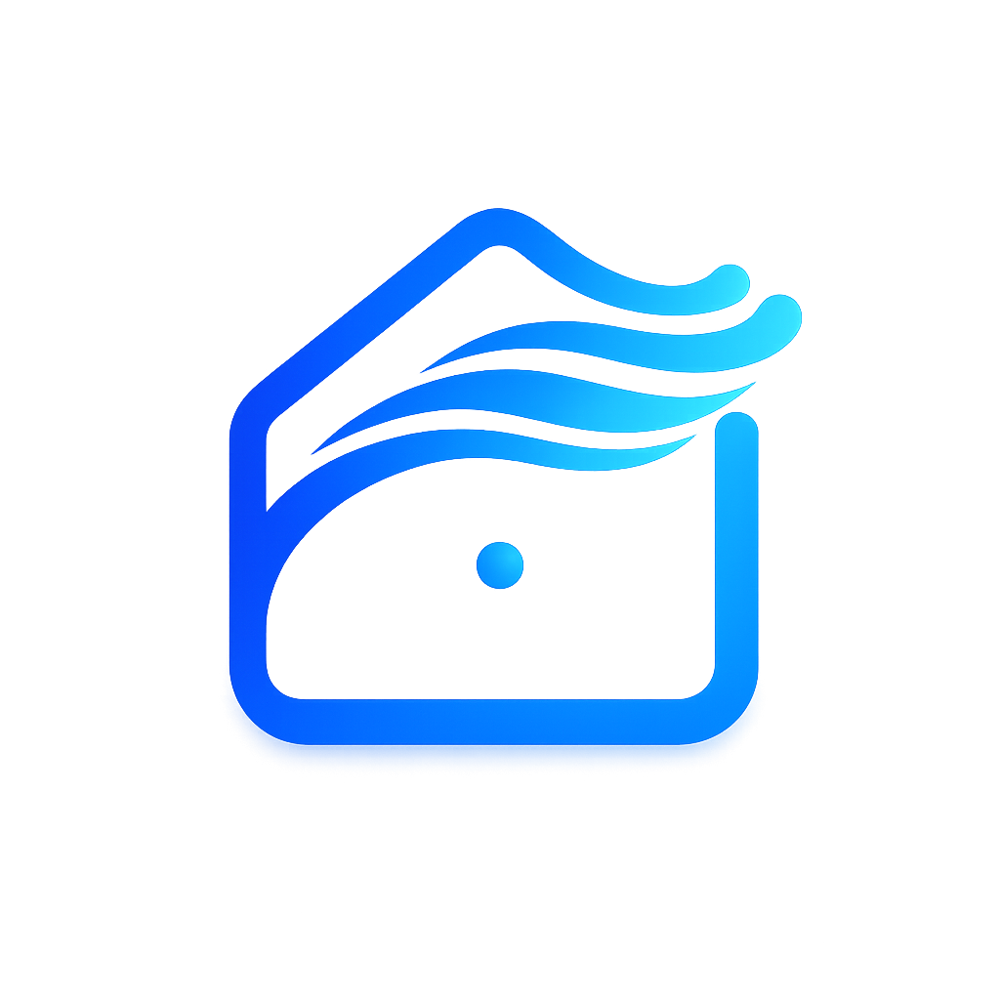

# Ambient Weather for Homebridge

> **This is a soft fork** of [peledies/homebridge-ambient-weather-sensors](https://github.com/peledies/homebridge-ambient-weather-sensors) maintained at [@bcourbage/homebridge-ambient-weather-sensors](https://www.npmjs.com/package/@bcourbage/homebridge-ambient-weather-sensors). The original work, design, and most of the code are by [Deac Karns](https://github.com/peledies). This fork adds **Homebridge 2.x / HAP 2.x compatibility** (closes upstream [#18](https://github.com/peledies/homebridge-ambient-weather-sensors/issues/18), [#19](https://github.com/peledies/homebridge-ambient-weather-sensors/issues/19)), plus multi-station naming, opt-in websocket realtime updates, CO2 / PM2.5 / PM10 sensor coverage, password-masked API key fields, and a polling refactor that consolidates per-accessory timers into one. Pull requests against upstream ([#21](https://github.com/peledies/homebridge-ambient-weather-sensors/pull/21), [#22](https://github.com/peledies/homebridge-ambient-weather-sensors/pull/22)) remain open; this fork exists so users on Homebridge 2 can use the plugin in the meantime.
>
> Install via the Homebridge UI plugin search, or:
>
> ```sh
> npm install -g @bcourbage/homebridge-ambient-weather-sensors
> ```

<SPAN ALIGN="CENTER" STYLE="text-align:center">
<DIV ALIGN="CENTER" STYLE="text-align:center">



## Complete HomeKit support for the Ambient Weather weather station ecosystem using [Homebridge](https://homebridge.io).


</DIV>
</SPAN>


## What's New in v1.5.0

v1.5.0 is the largest release of this plugin. **Existing users see no behavior change unless they opt in to the new sensors**, except they automatically gain low-battery push notifications on every sensor they already have.

- **Low-battery notifications for every probe** — Apple Home's built-in low-battery alerts now fire when AWN reports any sensor's battery as low. No setup needed.
- **Feels-like + dew-point temperatures** appear as new Temperature accessories (if `Temperature Sensors` was already enabled).
- **Extended Sensors (opt-in)** — wind, rain, barometric pressure, UV, and lightning, exposed as `MotionSensor` accessories with threshold-driven Apple Home automations. Live numeric values render in Eve / Controller for HomeKit.

**Upgrading from v1.4.x?** See the [upgrade guide](./UPGRADING.md) for what changes, what to enable, and example automations.

## Plugin Information
This plugin allows you to pull sensor data from your Ambient Weather weather station via its REST API and add those accessories to homebridge.

## Compatibility
- Homebridge `1.8+` and Homebridge `2.x`
- Node.js `22.12+` or `24.x`

## Features
- Supports parsing sensors attached to multiple weather stations
- Two data sources: REST polling (default, 2 minute cadence) or websocket realtime updates (opt-in)

## Data Source
The plugin can read sensor values one of two ways. Pick whichever fits your setup; both feed the same HomeKit accessories.

- **Polling** *(default)* — fetches the AWN REST endpoint every 2 minutes. Predictable cadence, minimal moving parts, easy to reason about. Updates lag the real reading by up to 2 minutes.
- **Realtime** *(opt-in via `dataSource: "realtime"`)* — opens a websocket to `rt2.ambientweather.net` and receives values as the station reports them (~30 second cadence indoors). Lower latency but more moving parts (a persistent connection with automatic reconnect).

Realtime is currently opt-in. The default will switch to realtime in a future release once it has been broadly validated.

## Supported Sensor Types

### Natively-supported by Apple Home

These map cleanly to native HomeKit accessory services. They render in Apple's Home app, Eve, and every other HomeKit client without any caveat.

- **Temperature** — outdoor, indoor, and per-probe (`tempf`, `tempinf`, `temp{1..N}f`). As of v1.5.0 the matcher also covers AWN's pre-calculated **feels-like** (heat index / wind chill) and **dew point** fields (`feelsLike`, `feelsLike{N}`, `feelsLikein`, `dewPoint`, `dewPoint{N}`, `dewPointin`).
- **Humidity** — outdoor, indoor, and per-probe.
- **Solar Radiation** — exposed as lux on a `LightSensor`. See the conversion note below.
- **CO2** — AWN's `co2_in_aqin` (AQIN module) and the standalone `co2` field.
- **Particulate Matter** — PM2.5 and PM10 (AWN's `pm25_in_aqin`, `pm10_in_aqin`, and the outdoor `pm25` field). Reported with both raw density and an EPA-bucket-derived HomeKit AirQuality rating.

### Battery status

Every sensor whose physical probe reports a battery in AWN's payload also exposes a HomeKit `Battery` sub-service. Apple Home (and every third-party HomeKit client) will fire its built-in low-battery push notification when AWN reports a probe as low. Use this to build the automation *"When Outdoor Temperature battery is low, remind me to replace it"* — no Eve dependency, no manual checking the AWN dashboard.

Probes covered: outdoor base (powers wind, rain, solar, UV, outdoor temp/humid), indoor display (indoor temp/humid + pressure), WH31 numbered probes (per-channel), AQIN module (PM, CO2), and the WH57 lightning sensor. Probes that AWN doesn't report a battery for get no Battery sub-service.

### Solar Radiation: W/m² ↔ lux

AWN reports solar radiation in **W/m²** (watts per square meter), but HomeKit's `LightSensor` characteristic accepts only **lux**. The plugin converts using the standard approximation:

```
lux ≈ W/m² ÷ 0.0079        (equivalently, lux ≈ W/m² × 127)
```

This factor assumes sunlight's spectral distribution, which matches the AWN sensor's design point. If you want the raw W/m² back from a HomeKit reading, just multiply the displayed lux value by `0.0079`.

### Extended Sensors (v1.5.0+)

Apple Home does not natively understand wind, rain, barometric pressure, UV, or lightning — there are no HAP services for those types. v1.5.0 adds them anyway using the same pattern as the verified [homebridge-ecowitt-weather-sensors](https://github.com/rhockenbury/homebridge-ecowitt-weather-sensors) plugin: each datapoint is exposed as a `MotionSensor` accessory with three additional custom characteristics:

- **Value** — the live numeric reading with units (e.g. `"14 mph"`, `"0.12 in/hr"`, `"315° (NW)"`)
- **Intensity** — qualitative bucket (Beaufort for wind, EPA scale for UV, NWS descriptors for rain)
- **Last Updated** — ISO-8601 timestamp of the most recent reading

| Sensor | AWN field(s) |
|---|---|
| Wind speed, gust, max-daily gust | `windspeedmph`, `windgustmph`, `maxdailygust` |
| Wind direction (instantaneous + 10-minute average) | `winddir`, `winddir_avg10m` |
| Rain rate | `hourlyrainin` |
| Rain accumulation (event, daily, weekly, monthly, yearly) | `eventrainin`, `dailyrainin`, `weeklyrainin`, `monthlyrainin`, `yearlyrainin` |
| Time since last rain | `lastRain` |
| Barometric pressure (sea-level corrected + raw at station) | `baromrelin`, `baromabsin` |
| UV index | `uv` |
| Lightning strike count (today, this hour) | `lightning_day`, `lightning_hour` |
| Lightning distance and time-since-last (requires WH57) | `lightning_distance`, `lightning_time` |

**How this looks in HomeKit:**

- **Apple Home**: each extended sensor appears as a Motion Sensor tile labeled by sensor name (e.g. "Wind Speed"). The motion state toggles on/off based on a configurable threshold — so you can write a stock Home automation like *"When Wind Speed motion detected, close the awning"*. The live numeric value is not directly visible in Apple Home.
- **Eve / Controller for HomeKit**: each tile shows the live Value, Intensity bucket, and Last Updated timestamp on the same accessory.

**Optional embed-value mode:** if you want the live numeric value visible in Apple Home tiles too, switch the display mode in plugin settings. The tile name updates on every reading (e.g. *"Wind Speed 14 mph"*). Values are rounded to whole numbers to stay compatible with Apple Home's naming rules. Trade-offs are documented next to the setting.

**All extended sensors are off by default.** Enable the master "Extended Sensors" toggle in the plugin settings, then pick which sub-categories you want. Threshold values and display units are configurable.

**Why MotionSensor?** It's the only HAP service whose state (`MotionDetected`) is both native to Apple Home AND triggerable by an external value, which makes it work as a universal "this number crossed a threshold" sensor. Picking it puts you in good company — every comparable plugin (homebridge-ecowitt-weather-sensors, homebridge-weather-plus, homebridge-mqttthing's weather station) settled on the same idea.

**Hardware-aware (safe to over-enable):** the plugin only creates an accessory for a sensor field that's actually present in your station's AWN payload. If you enable a category whose hardware you don't have (e.g. Lightning without a WH57, Air Quality without an AQIN, CO2 without an AQIN), the relevant fields are simply absent from AWN's response, no accessory is registered, and nothing appears in HomeKit. Enabling a category is a zero-cost no-op when the underlying hardware isn't installed — so when in doubt, leave it on.

## Setup
An ambientweather.net account is required (no paid subscription is needed) so that you can generate the two keys this plugin uses.

You will need two keys to configre this plugin and they can both be generate on the [Ambient Weather Account Page](https://ambientweather.net/account). This part has been a point of confusion for many users.

creating the API key is straight forward. click the `Create API Key` button and give it a name if you would like.

Creating the Application key involves clicking the following link at the bottom of the 'API Keys' section.

`Developers: An Application Key is also required for each application that you develop. Click here to create one.`

A textbox will come up and you can either leave that blank or put a note in there (It doesn't appear to matter or get displayed anywhere) if you like and click `Create Application Key`.

These keys will get used when you setup the plugin in Homebridge.

## Credits and Acknowledgments

The original work, design, and the vast majority of the code in this plugin are by **[Deac Karns (@peledies)](https://github.com/peledies)**, who created and maintained [homebridge-ambient-weather-sensors](https://github.com/peledies/homebridge-ambient-weather-sensors). The decision to use Ambient Weather's official REST API rather than scraping or BLE bridging is what made this plugin viable in the first place, and it's still the cleanest path to AWN data on HomeKit.

This fork exists only because upstream activity has been quiet (last commit February 2025; pull requests [#21](https://github.com/peledies/homebridge-ambient-weather-sensors/pull/21) and [#22](https://github.com/peledies/homebridge-ambient-weather-sensors/pull/22) sat unmerged) and the plugin stopped working under Homebridge 2.0. Once upstream resumes activity and merges the compatibility PRs, this fork can be sunset — please consider it a temporary bridge, not a competitor.

**If you find this plugin useful**, the appropriate place to donate or thank the author is Deac's PayPal link, preserved unchanged in `package.json`'s `funding` field: [paypal.me/deackarns](https://paypal.me/deackarns).

### Changes in this fork beyond upstream v1.3.2

- Homebridge 2.x / HAP 2.x compatibility (engines bump to Node 22+, ESM migration, HAP v2 stricter `Name` validation)
- Multi-station accessory naming using AWN's `info.name` (instead of bare MAC + sensor key)
- Polling refactor: one platform-level timer instead of N per-accessory timers (eliminates parallel-fetch race against AWN's 1 req/s rate limit; disk cache no longer needed)
- Per-sensor exclusion list (`excludeSensors`) and complementary allowlist (`includeOnly`) with case-insensitive, multi-form matching
- Opt-in websocket realtime data source via AWN's `rt2.ambientweather.net` socket.io endpoint
- CO2 (AQIN) sensor support as HomeKit `CarbonDioxideSensor`
- PM2.5 / PM10 (AQIN) support as HomeKit `AirQualitySensor` with EPA-bucket-derived AirQuality enum
- API/application keys masked as password fields in homebridge-config-ui-x
- Independent latent bug fixes (`Cache.isValid()` async-in-sync, ProductData characteristic on the wrong service, etc.)
- **v1.5.0** — Extended sensors (wind, rain, barometric pressure, UV, lightning) exposed as `MotionSensor` accessories with custom Value/Intensity/Last-Updated characteristics; threshold-driven Apple Home automations; optional embed-value tile mode; per-unit selection; bonus native sensors (feels-like and dew point per probe)

### License

Apache License 2.0 — preserved unchanged from upstream. See [LICENSE](./LICENSE) and [NOTICE](./NOTICE).

### Trademark notice

"Ambient Weather" is a trademark of [Ambient Weather, Inc.](https://ambientweather.com/). This plugin is an independent, unofficial integration that uses the trademark only to identify the product it interoperates with (nominative fair use). It is not affiliated with, endorsed by, or sponsored by Ambient Weather, Inc.
