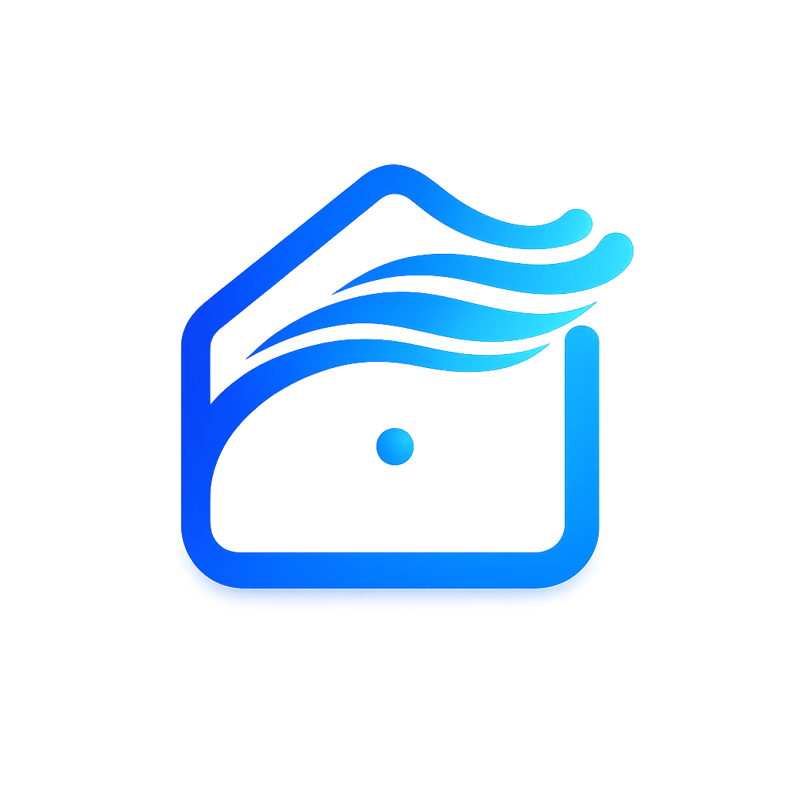

# Ambient Weather for Homebridge

> **Originally a fork** of [homebridge-ambient-weather-sensors](https://github.com/peledies/homebridge-ambient-weather-sensors) by [Deac Karns](https://github.com/peledies), now independently maintained as [@bcourbage/homebridge-ambient-weather-sensors](https://www.npmjs.com/package/@bcourbage/homebridge-ambient-weather-sensors). This plugin adds **Homebridge 2.x / HAP 2.x compatibility**, multi-station naming, opt-in websocket realtime updates, CO2 / PM2.5 / PM10 sensor coverage, password-masked API key fields, and a polling engine that consolidates per-accessory timers into one.
>
> Install via the Homebridge UI plugin search, or:
>
> ```sh
> npm install -g @bcourbage/homebridge-ambient-weather-sensors
> ```

<SPAN ALIGN="CENTER" STYLE="text-align:center">
<DIV ALIGN="CENTER" STYLE="text-align:center">



## Complete HomeKit support for the Ambient Weather weather station ecosystem using [Homebridge](https://homebridge.io).


</DIV>
</SPAN>


## Sensor-map v2.0 (beta, opt-in)

The v2.0 betas ship a new sensor-map architecture that unifies which
sensors expose, how they're named, and which HomeKit types they use.
**The new pipeline is OFF by default; for legacy-compatible configs,
leaving the flag off preserves v1.7.0 runtime behavior.**

Opt in one of two ways:

- Set environment variable `SENSOR_MAP_V2=1` on the Homebridge
  process, OR
- Enable `_sensorMapV2` under the "Advanced (v2.0 preview)"
  fieldset in the plugin's config UI.

Then restart Homebridge.

**What the flag does (since v2.0.0-beta.8):** it selects the LIVE v2
reconciliation path. Accessory registration, naming, and value
routing are driven by the v2 sensor map, and the plugin may
re-register an accessory when its structure changes; each such
change is recorded as a notice, visible on the plugin's page in
Homebridge Config UI X. (In beta.0 through beta.7 the same flag ran
a compare-only "shadow mode" that logged divergences without ever
touching registration; that observer has been retired in favor of
the real thing.)

**Saving from the editor converts your configuration.** The
sensor-map editor's first save rewrites the plugin's config block to
the v2 format (`configVersion: 2` plus a `sensorMap`). Before
`config.json` changes, your original 1.x settings are preserved in an
immutable snapshot: `legacy-config-snapshot.json` in the plugin's
data directory (`<homebridge storage>/plugin-data/ambient-weather/`).
The saved block also carries a synchronized 1.7.x mirror of the
legacy fields, kept up to date on every save.

**Rollback before any editor save (legacy config, flag on):** the
plugin never converts your configuration on its own, so turning the
flag off and restarting cleanly returns you to v1.7 behavior.
Accessories the v2 path structurally re-registered while it was on
may need their room assignments redone in Apple Home. Downgrading to
the 1.7.x line is safe under the same condition.

**Rollback after an editor save (or any v2 config):** do NOT simply
turn the flag off — with the flag off, the v1 path cannot read
`sensorMap` and can deregister your cached accessories. Instead:

- **To return to 1.x behavior on 2.x:** restore a 1.x-shaped config
  first (copy the fields from `legacy-config-snapshot.json` back into
  the plugin's config block, replacing `configVersion` and
  `sensorMap`), then disable the flag and restart.
- **For an emergency downgrade with the v2 config still in place:**
  install the current **1.7.x** release (never v1.7.0 or earlier).
  It freezes safely: cached accessories stay in HomeKit at their
  last-known values, updates stop, and the log explains how to
  resume. The mirror keeps that freeze safe; it does not make 1.7.x
  operate the v2 config.
- **Custom v2-only sensors** (added through the editor for fields the
  plugin has no built-in definition for): no 1.x release can operate
  or update them. The 1.7.x freeze preserves their cached tiles at
  last-known values, and restoring a legacy config and resuming
  normal 1.x reconciliation removes them.

The plugin's settings page carries the v2 panels: status, discovery,
notices, and the sensor-map editor (draft, preview, and save with
guarded confirmation — saving requires the v2 flag).
[docs/plugin-ui.md](./docs/plugin-ui.md) explains each panel and how
saving works. See `docs/future/sensor-map.md` for the full design if
you're curious about the shape of the v2 config.

## What's New in v1.7.2

Documentation and metadata release; no code change.

## What's New in v1.7.1

Safety release on the 1.x line; no behavior change for normal 1.x configurations. If a 2.x version of this plugin writes its new configuration format (`configVersion: 2` and a `sensorMap` section) and you later downgrade to 1.x, v1.7.1 freezes safely instead of misreading the config: cached accessories stay in HomeKit at their last-known values, data updates stop, and the log explains how to resume (restore a 1.x configuration, or upgrade back to 2.x). Earlier 1.x versions would instead deregister every cached accessory after such a downgrade, losing room assignments and automations.

## What's New in v1.7.0

Preparatory release for the v2.0.0 sensor-map architecture. **No behavior change for standard users.** The sensor-map code loads into memory but stays inert unless explicitly opted into via the environment variable `SENSOR_MAP_V2=1`, which on the 1.7.x line runs a compare-only shadow-mode observer alongside the v1.6.0 code path.

Release notes for earlier versions live in [CHANGELOG.md](./CHANGELOG.md). Upgrading from v1.4.x? See the [upgrade guide](./UPGRADING.md) for what changes, what to enable, and example automations.

## Plugin Information
This plugin allows you to pull sensor data from your Ambient Weather weather station via its REST API and add those accessories to homebridge.

## Compatibility
- Homebridge `1.8+` and Homebridge `2.x`
- Node.js `22.13+` or `24.x`

## Features
- Supports parsing sensors attached to multiple weather stations
- Two data sources: REST polling (default, 2 minute cadence) or websocket realtime updates (opt-in)
- **Multi-Home support** for users with stations in physically separate places (main house + cabin, primary residence + rental, etc.). Each station can appear in its own HomeKit Home via the `stationFilter` config field and Homebridge child bridges. See [MultiHome.md](./MultiHome.md) for the full walkthrough.

## Data Source
The plugin can read sensor values one of two ways. Pick whichever fits your setup; both feed the same HomeKit accessories.

- **Polling** *(default)*: fetches the AWN REST endpoint every 2 minutes. Predictable cadence, minimal moving parts, easy to reason about. Updates lag the real reading by up to 2 minutes.
- **Realtime** *(opt-in via `dataSource: "realtime"`)*: opens a websocket to `rt2.ambientweather.net` and receives values as the station reports them (~30 second cadence indoors). Lower latency but more moving parts (a persistent connection with automatic reconnect).

Realtime is currently opt-in. The default will switch to realtime in a future release once it has been broadly validated.

## Supported Sensor Types

### Natively-supported by Apple Home

These map cleanly to native HomeKit accessory services. They render in Apple's Home app, Eve, and every other HomeKit client without any caveat.

- **Temperature**: outdoor, indoor, and per-probe (`tempf`, `tempinf`, `temp{1..N}f`). As of v1.5.0 the matcher also covers AWN's pre-calculated **feels-like** (heat index / wind chill) and **dew point** fields (`feelsLike`, `feelsLike{N}`, `feelsLikein`, `dewPoint`, `dewPoint{N}`, `dewPointin`).
- **Humidity**: outdoor, indoor, and per-probe.
- **Solar Radiation**: exposed as lux on a `LightSensor`. See the conversion note below.
- **CO2**: AWN's `co2_in_aqin` (AQIN module) and the standalone `co2` field.
- **Particulate Matter**: PM2.5 and PM10 (AWN's `pm25_in_aqin`, `pm10_in_aqin`, and the outdoor `pm25` field). Reported with both raw density and an EPA-bucket-derived HomeKit AirQuality rating.

### Battery status

Every sensor whose physical probe reports a battery in AWN's payload also exposes a HomeKit `Battery` sub-service. Apple Home (and every third-party HomeKit client) will fire its built-in low-battery push notification when AWN reports a probe as low. Use this to build the automation *"When Outdoor Temperature battery is low, remind me to replace it"*: no Eve dependency, no manual checking of the AWN dashboard.

Probes covered: outdoor base (powers wind, rain, solar, UV, outdoor temp/humid), indoor display (indoor temp/humid + pressure), WH31 numbered probes (per-channel), AQIN module (PM, CO2), and the WH31L lightning sensor (Ecowitt WH57 equivalent hardware). Each physical probe shows ONE battery sub-service in HomeKit (attached to its most-representative accessory), not one per accessory the probe powers. See the Troubleshooting section in [UPGRADING.md](./UPGRADING.md) for how this maps. Probes that AWN doesn't report a battery for get no Battery sub-service.

**Note on the lightning sensor battery:** AWN's API has been observed to report the lightning sensor as low-battery (`batt_lightning = 0`) even when fresh batteries are installed and the AWN dashboard itself shows the sensor as healthy. The plugin reads what AWN's API returns. If your lightning Battery tile in HomeKit disagrees with the AWN dashboard, the issue is upstream of this plugin. Replacing the batteries doesn't help; consider it cosmetic until AWN fixes their API. To suppress the spurious low-battery notifications, add `batt_lightning` (or `Lightning Strikes Today-batt`) to the `Exclude Sensors` list in plugin config. See [UPGRADING.md](./UPGRADING.md) for details.

### Solar Radiation: W/m² ↔ lux

AWN reports solar radiation in **W/m²** (watts per square meter), but HomeKit's `LightSensor` characteristic accepts only **lux**. The plugin converts using the standard approximation:

```
lux ≈ W/m² ÷ 0.0079        (equivalently, lux ≈ W/m² × 127)
```

This factor assumes sunlight's spectral distribution, which matches the AWN sensor's design point. If you want the raw W/m² back from a HomeKit reading, just multiply the displayed lux value by `0.0079`.

### Extended Sensors (v1.5.0+)

Apple Home does not natively understand wind, rain, barometric pressure, UV, or lightning: there are no HAP services for those types. v1.5.0 adds them anyway using the same pattern as the verified [homebridge-ecowitt-weather-sensors](https://github.com/rhockenbury/homebridge-ecowitt-weather-sensors) plugin: each datapoint is exposed as a `MotionSensor` accessory with three additional custom characteristics:

- **Value**: the live numeric reading with units (e.g. `"14 mph"`, `"0.12 in/hr"`, `"315° (NW)"`)
- **Intensity**: qualitative bucket (Beaufort for wind, EPA scale for UV, NWS descriptors for rain)
- **Last Updated**: ISO-8601 timestamp of the most recent reading

| Sensor | AWN field(s) |
|---|---|
| Wind speed, gust, max-daily gust | `windspeedmph`, `windgustmph`, `maxdailygust` |
| Wind direction (instantaneous + 10-minute average) | `winddir`, `winddir_avg10m` |
| Rain rate | `hourlyrainin` |
| Rain accumulation (event, daily, weekly, monthly, yearly) | `eventrainin`, `dailyrainin`, `weeklyrainin`, `monthlyrainin`, `yearlyrainin` |
| Time since last rain | `lastRain` |
| Barometric pressure (sea-level corrected + raw at station) | `baromrelin`, `baromabsin` |
| UV index | `uv` |
| Lightning strike count (today, this hour) | `lightning_day`, `lightning_hour` |
| Lightning distance and time-since-last (requires WH31L) | `lightning_distance`, `lightning_time` |

**How this looks in HomeKit:**

- **Apple Home**: each extended sensor appears as a Motion Sensor tile labeled by sensor name (e.g. "Wind Speed"). The motion state toggles on/off based on a configurable threshold, so you can write a stock Home automation like *"When Wind Speed motion detected, close the awning"*. The live numeric value is not directly visible in Apple Home.
- **Eve / Controller for HomeKit**: each tile shows the live Value, Intensity bucket, and Last Updated timestamp on the same accessory.

**Optional embed-value mode:** if you want the live numeric value visible in Apple Home tiles too, switch the display mode in plugin settings. The tile name updates on every reading (e.g. *"Wind Speed 14 mph"*). Values are rounded to whole numbers to stay compatible with Apple Home's naming rules. Trade-offs are documented next to the setting.

**All extended sensors are off by default.** Enable the master "Extended Sensors" toggle in the plugin settings, then pick which sub-categories you want. Threshold values and display units are configurable.

**Why MotionSensor?** It's the only HAP service whose state (`MotionDetected`) is both native to Apple Home AND triggerable by an external value, which makes it work as a universal "this number crossed a threshold" sensor. Picking it puts you in good company: every comparable plugin (homebridge-ecowitt-weather-sensors, homebridge-weather-plus, homebridge-mqttthing's weather station) settled on the same idea.

**Hardware-aware (safe to over-enable):** the plugin only creates an accessory for a sensor field that's actually present in your station's AWN payload. If you enable a category whose hardware you don't have (e.g. Lightning without a WH31L, Air Quality without an AQIN, CO2 without an AQIN), the relevant fields are simply absent from AWN's response, no accessory is registered, and nothing appears in HomeKit. Enabling a category is a zero-cost no-op when the underlying hardware isn't installed, so when in doubt, leave it on.

## Setup
An ambientweather.net account is required (no paid subscription is needed) so that you can generate the two keys this plugin uses.

You will need two keys to configure this plugin; both can be generated on the [Ambient Weather Account Page](https://ambientweather.net/account). This part has been a point of confusion for many users.

Creating the API key is straightforward: click the `Create API Key` button and give it a name if you would like.

Creating the Application key involves clicking the following link at the bottom of the 'API Keys' section.

`Developers: An Application Key is also required for each application that you develop. Click here to create one.`

A textbox will come up; leave it blank or put a note in it (it doesn't appear to matter or get displayed anywhere), then click `Create Application Key`.

These keys will get used when you setup the plugin in Homebridge.

## Credits and Acknowledgments

This plugin began as a fork of [homebridge-ambient-weather-sensors](https://github.com/peledies/homebridge-ambient-weather-sensors) by **[Deac Karns (@peledies)](https://github.com/peledies)**. His original design, including the decision to build on Ambient Weather's official REST API rather than scraping or BLE bridging, remains at the heart of this plugin.

### Changes beyond the original v1.3.2

- Homebridge 2.x / HAP 2.x compatibility (engines bump to Node 22+, ESM migration, HAP v2 stricter `Name` validation)
- Multi-station accessory naming using AWN's `info.name` (instead of bare MAC + sensor key)
- Polling refactor: one platform-level timer instead of N per-accessory timers (eliminates parallel-fetch race against AWN's 1 req/s rate limit; disk cache no longer needed)
- Per-sensor exclusion list (`excludeSensors`) and complementary allowlist (`includeOnly`) with case-insensitive, multi-form matching
- Opt-in websocket realtime data source via AWN's `rt2.ambientweather.net` socket.io endpoint
- CO2 (AQIN) sensor support as HomeKit `CarbonDioxideSensor`
- PM2.5 / PM10 (AQIN) support as HomeKit `AirQualitySensor` with EPA-bucket-derived AirQuality enum
- API/application keys masked as password fields in homebridge-config-ui-x
- Independent latent bug fixes (`Cache.isValid()` async-in-sync, ProductData characteristic on the wrong service, etc.)
- **v1.5.0**: Extended sensors (wind, rain, barometric pressure, UV, lightning) exposed as `MotionSensor` accessories with custom Value/Intensity/Last-Updated characteristics; threshold-driven Apple Home automations; optional embed-value tile mode; per-unit selection; bonus native sensors (feels-like and dew point per probe); `stationFilter` field for assigning stations to separate HomeKit Homes via child bridges (see [MultiHome.md](./MultiHome.md))

### License

Apache License 2.0, preserved unchanged from the original project. See [LICENSE](./LICENSE) and [NOTICE](./NOTICE).

### Trademark notice

"Ambient Weather" is a trademark of [Ambient Weather, Inc.](https://ambientweather.com/). This plugin is an independent, unofficial integration that uses the trademark only to identify the product it interoperates with (nominative fair use). It is not affiliated with, endorsed by, or sponsored by Ambient Weather, Inc.
