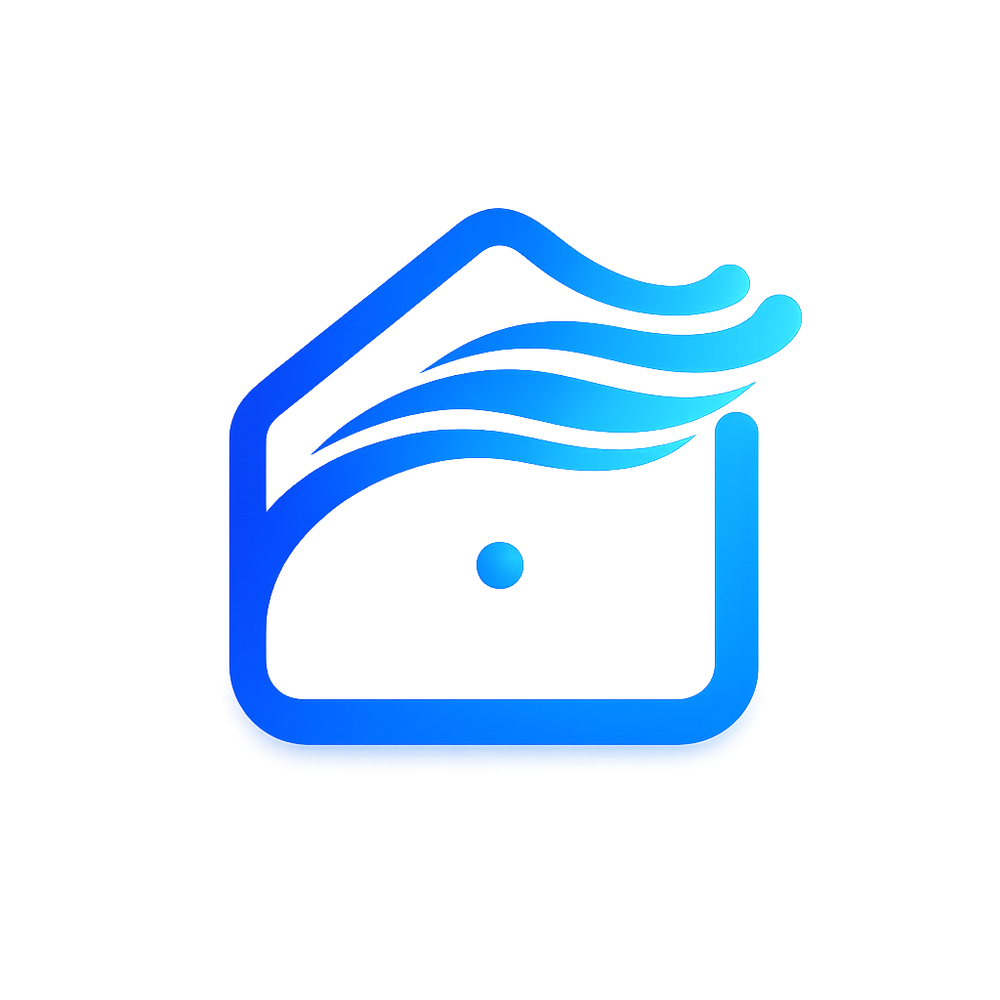

# Ambient Weather for Homebridge

> **Originally a fork** of [homebridge-ambient-weather-sensors](https://github.com/peledies/homebridge-ambient-weather-sensors) by [Deac Karns](https://github.com/peledies), now independently maintained as [@bcourbage/homebridge-ambient-weather-sensors](https://www.npmjs.com/package/@bcourbage/homebridge-ambient-weather-sensors). Manage individual Ambient Weather sensors in Homebridge, with previewed changes, custom sensor interpretations, multi-station support, and polling or realtime updates.
>
> Install via the Homebridge UI plugin search, or:
>
> ```sh
> npm install -g @bcourbage/homebridge-ambient-weather-sensors
> ```

<SPAN ALIGN="CENTER" STYLE="text-align:center">
<DIV ALIGN="CENTER" STYLE="text-align:center">



## Ambient Weather sensors in Apple Home using [Homebridge](https://homebridge.io)


[](https://github.com/sponsors/bcourbage)

</DIV>
</SPAN>


## What's new in v2.0.0

Version 2.0 puts individual sensor control in one editor. Give sensors useful
names, choose units and thresholds, and switch off readings you do not want.
Connection settings live on the same page, with a preview showing which Apple
Home accessories will be added, removed, or replaced before you save.

Support now extends to more wind and rain readings, soil and leaf measurements,
AQI values, and leak sensors. For an unfamiliar field, choose a supported sensor
type and source unit, or use the generic numeric option with your own unit label.
Extended numeric readings appear as motion accessories in Apple Home, while
compatible controller apps show the labelled value. AQI stays a plain number;
native carbon-monoxide detection is not included.

Installing the update leaves your configuration in place and does not
automatically enable newer sensor support. When ready, convert your legacy
settings and use **Review new sensor support** to see what becomes available,
including corrected lightning and leak battery readings. Both changes are
previewed before saving. Conversion preserves known disabled sensors, but
future recognized fields are managed individually rather than by the old
category-wide exclusions.

Back up your configuration and follow the
[upgrade guide](https://github.com/bcourbage/homebridge-ambient-weather-sensors/blob/main/UPGRADING.md)
for conversion, sensor-support updates, and rollback. If you already use
beta.19, your sensors will work as before. The editor now explains what may
change if you return to an older plugin version. The
[release notes](https://github.com/bcourbage/homebridge-ambient-weather-sensors/blob/main/CHANGELOG.md)
summarize the full 2.0 release.

## Sensor-map v2.0

The sensor map determines which readings appear in Apple Home, how they are
named, and which accessory types they use. It is enabled by default in v2.0.0,
but can read a legacy (1.x-style) configuration without rewriting it. This
compatibility translation preserves valid sensor settings, accessory
identities, names, units, and thresholds; invalid legacy unit names use the
documented default instead. Regression tests compare the resulting HomeKit
accessories with those produced by the published 1.7.3 plugin. Your
configuration is written only when you save from the settings page.

Opting OUT: set the environment variable `SENSOR_MAP_V2=0` on the
Homebridge process, or set `_sensorMapV2: false` in the plugin's
config block, and restart. The environment setting takes precedence: remove
`SENSOR_MAP_V2` if set, or set it to `0`, when opting out through the config.
This selects the legacy pipeline,
**but the opt-out ALONE is safe only for a configuration that was
never converted** (no `configVersion: 2` / `sensorMap` in the block).
The v1.7.0 pipeline cannot read a converted configuration and can
DEREGISTER its accessories; once you have saved in the sensor-map
editor, follow the rollback recipes below instead of flipping the
opt-out by itself.

Applying configuration changes needs a restart: Homebridge's
**Restart Child Bridge** action for this plugin is sufficient (it
re-reads the plugin's configuration from disk; verified on Homebridge
2.4.0). Killing the child-bridge process by hand does NOT re-read the
configuration; a full Homebridge restart also works.

**What the v2 pipeline does:** accessory registration, naming, and
value routing are driven by the v2 sensor map, and the plugin may
re-register an accessory when its structure changes; each such
change is recorded and shown in the "Recent structural changes"
disclosure on the plugin's settings page in Homebridge Config UI X.

**Conversion is explicit and previewed.** Saving a conversion preview
or the first full sensor-map edit rewrites the plugin's config block
to the v2 format (`configVersion: 2` plus a `sensorMap`). A
Connection-only save without a station-filter change does not convert it. A
station-filter change uses the sensor-map preview and can convert the block. Before
`config.json` changes, your original 1.x settings are preserved in an
immutable snapshot: `legacy-config-snapshot.json` in the plugin's
data directory (`<homebridge storage>/plugin-data/ambient-weather/`).
The saved block also carries a synchronized 1.7.x mirror of the
legacy fields, kept up to date on every save.

<a id="rollback"></a>
**Rollback before conversion (legacy config, flag on):** the
plugin never converts your configuration on its own, so turning the
flag off and restarting cleanly returns you to v1.7 behavior.
Accessories the v2 path structurally re-registered while it was on
may need their room assignments redone in Apple Home. Downgrading to
the 1.7.x line is safe under the same condition.

**Rollback after conversion (or any v2 config):** do NOT simply
turn the flag off — with the flag off, the v1 path cannot read
`sensorMap` and can deregister your cached accessories. Choose the appropriate
recovery path:

- **Emergency freeze (no config edit):** install the current
  **1.7.x** release (never v1.7.0 or earlier) with the v2 config
  still in place. Its guard detects the v2 configuration and freezes
  instead of reconciling: cached accessories stay in HomeKit at their
  last-known values, updates stop, and the log explains how to
  resume. The safety comes entirely from that guard — guarded
  v1.7.1+ releases do not interpret a v2-marked configuration.
  (v1.7.0 and earlier DO attempt to read it, which is exactly why
  the emergency target is the current 1.7.x.)
- **Returning to 1.7.x:** first open the plugin's settings page and look
  for **"Rollback mirror: verified"**. Do not follow these steps unless
  that message appears; otherwise, sensors you want to keep could be
  removed from Apple Home.

  **Your sensors may behave differently.** Sensors 1.7.x does not support
  will disappear from Apple Home. Names, units, values shown in tile names,
  and battery indicators may change. Motion sensors may trigger again even
  if you turned triggering off, or trigger under different conditions.
  If you gave the same type of sensor different trigger levels at different
  stations, those differences may be lost. Back up your full Homebridge
  configuration before continuing, then check your sensors and automations
  after restarting.

  With the verified indicator shown, delete exactly three entries from
  the plugin's config block: `sensorMap`, `configVersion`, and `_legacyMirror`.
  Keep
  everything else, ALSO set or replace `_sensorMapV2` with `false`
  in the block, and remove `SENSOR_MAP_V2` from the Homebridge environment
  if set, or set it to `0`. The environment takes precedence
  over the config entry. Then run 1.7.x (or 2.x
  with the opt-out active) and restart. If the page shows any
  other mirror status (absent, stale, or invalid): do NOT delete the
  markers — freeze on current 1.7.x, restore the snapshot (next
  path), or upgrade back to 2.x and re-save in the editor to
  regenerate the mirror.

  You will need your backup to recover lost v2 settings; reinstalling v2
  or converting your settings again will not restore them. If you later
  convert back to v2 with legacy sensor settings that differ from your original
  snapshot, the editor preserves them in the `legacy-conversion-journal` folder.
  Your original pre-conversion snapshot is kept unchanged. These recovery
  copies contain only legacy sensor settings, not all your v2 choices.
- **Rollback to your ORIGINAL (pre-conversion) settings:** open
  `legacy-config-snapshot.json` and use its `legacy` object. In the
  plugin's config block, delete every legacy sensor-configuration
  field (the sensor category toggles, `extendedDisplayMode`,
  `thresholds`, `units`, `excludeSensors`, `includeOnly`), copy in
  the snapshot's `legacy` fields as the replacement — the snapshot
  is sparse, so replace rather than overlay — delete `sensorMap`,
  `configVersion`, and `_legacyMirror`, and set
  `_sensorMapV2: false`. Remove `SENSOR_MAP_V2` from the Homebridge
  environment if set, or set it to `0`. Restart.
- **Rollback to a JOURNALED (post-rollback) baseline:** if you rolled
  back and later reconverted, the settings you rolled back to are in
  the `legacy-conversion-journal` folder (same directory as the
  snapshot), one file per baseline: `entry-000001.json`,
  `entry-000002.json`, … Pick the file you want — the
  HIGHEST-numbered entry is the most recent pre-reconversion
  baseline — and restore it exactly like the snapshot, sourcing the
  fields from that file's `legacy` object: delete every legacy
  sensor-configuration field, copy in the entry's `legacy` fields as
  the replacement (entries are sparse, so replace rather than
  overlay), delete `sensorMap`, `configVersion`, and `_legacyMirror`,
  set `_sensorMapV2: false`, remove `SENSOR_MAP_V2` from the Homebridge
  environment if set or set it to `0`, and restart.
- **Custom v2-only sensors** (added through the editor for fields the
  plugin has no built-in definition for): no 1.x release can operate
  or update them. The 1.7.x freeze preserves their cached tiles at
  last-known values, and restoring a legacy config and resuming
  normal 1.x reconciliation removes them.

The plugin's settings page is the sensor-map editor with its
Connection section: draft, preview, and save with guarded
confirmation. [docs/plugin-ui.md](./docs/plugin-ui.md) explains the
page and how saving works. See `docs/future/sensor-map.md` for the full design if
you're curious about the shape of the v2 config.

## What's New in v1.7.2

Documentation and metadata release; no code change.

## What's New in v1.7.1

Safety release on the 1.x line; no behavior change for normal 1.x configurations. If a 2.x version of this plugin writes its new configuration format (`configVersion: 2` and a `sensorMap` section) and you later downgrade to 1.x, v1.7.1 freezes safely instead of misreading the config: cached accessories stay in HomeKit at their last-known values, data updates stop, and the log explains how to resume (restore a 1.x configuration, or upgrade back to 2.x). Earlier 1.x versions would instead deregister every cached accessory after such a downgrade, losing room assignments and automations.

## What's New in v1.7.0

Preparatory release for the v2.0.0 sensor-map architecture. **No behavior change for standard users.** The sensor-map code loads into memory but stays inert unless explicitly opted into via the environment variable `SENSOR_MAP_V2=1`, which on the 1.7.x line runs a compare-only shadow-mode observer alongside the v1.6.0 code path.

Release notes for earlier versions live in [CHANGELOG.md](./CHANGELOG.md). Upgrading from v1.4.x? See the [upgrade guide](./UPGRADING.md) for what changes, what to enable, and example automations.

## Plugin Information
This plugin reads sensor data from Ambient Weather through REST polling or websocket updates and exposes supported readings through Homebridge.

## Compatibility
- Homebridge `1.9+` within `1.x`, or Homebridge `2.x`
- Node.js `22.13+` within `22.x`, or `24.x`

Use a Node version supported by both the plugin and Homebridge. The minimum
Homebridge 1.9.0 host is verified on Node 22.13.0; it does not support Node 24.
The editor is verified with Homebridge Config UI X 5.29.0. Older UI versions
are not part of the GA validation matrix.

## Features
- Supports parsing sensors attached to multiple weather stations
- Two data sources: REST polling (default, 2 minute cadence) or websocket realtime updates (opt-in)
- **Multi-Home support** for users with stations in physically separate places (main house + cabin, primary residence + rental, etc.). Each station can appear in its own HomeKit Home via the `stationFilter` config field and Homebridge child bridges. See [MultiHome.md](./MultiHome.md) for the full walkthrough.

## Data Source
The plugin can read sensor values one of two ways. Pick whichever fits your setup; both feed the same HomeKit accessories.

- **Polling** *(default)*: fetches the AWN REST endpoint every 2 minutes. Predictable cadence, minimal moving parts, easy to reason about. Updates lag the real reading by up to 2 minutes.
- **Realtime** *(opt-in via `dataSource: "realtime"`)*: opens a websocket to `rt2.ambientweather.net` and receives values as the station reports them (~30 second cadence indoors). Lower latency but more moving parts (a persistent connection with automatic reconnect).

Realtime is currently opt-in. The default will switch to realtime in a future release once it has been broadly validated.

## Supported Sensor Types

### Natively-supported by Apple Home

These readings use native HomeKit sensor services. Available fields depend on the station and the sensor-support version in use.

- **Temperature**: outdoor, indoor, and per-probe (`tempf`, `tempinf`, `temp{1..N}f`). As of v1.5.0 the matcher also covers AWN's pre-calculated **feels-like** (heat index / wind chill) and **dew point** fields (`feelsLike`, `feelsLike{N}`, `feelsLikein`, `dewPoint`, `dewPoint{N}`, `dewPointin`).
- **Humidity**: outdoor, indoor, and per-probe.
- **Solar Radiation**: exposed as lux on a `LightSensor`. See the conversion note below.
- **CO2**: AWN's `co2_in_aqin` (AQIN module) and the standalone `co2` field.
- **Particulate Matter**: PM2.5 and PM10 (AWN's `pm25_in_aqin`, `pm10_in_aqin`, and the outdoor `pm25` field). Reported with both raw density and an EPA-bucket-derived HomeKit AirQuality rating.
- **Leak state**: supported leak fields use HomeKit's leak sensor. Custom boolean assignments can also use contact, occupancy, smoke, or motion services. The editor explains each input encoding. Invalid or offline values report a fault rather than an active alert. These integrations are not substitutes for certified safety alarms.

### Battery status

For supported battery relationships, one representative accessory per physical probe exposes a HomeKit `Battery` sub-service. Battery status is a low/normal indication, not a measured percentage. Notification behavior depends on the HomeKit client and its settings.

Probes covered: outdoor base (powers wind, rain, solar, UV, outdoor temp/humid), indoor display (indoor temp/humid + pressure), WH31 numbered probes (per-channel), AQIN module (PM, CO2), and the WH31L lightning sensor (Ecowitt WH57 equivalent hardware). Each physical probe shows ONE battery sub-service in HomeKit (attached to its most-representative accessory), not one per accessory the probe powers. See the Troubleshooting section in [UPGRADING.md](./UPGRADING.md) for how this maps. Probes that AWN doesn't report a battery for get no Battery sub-service.

**Lightning and leak battery interpretation:** the sensor-support update corrects their documented polarity: `0` means normal and `1` means low. Existing configurations retain the historical interpretation until support version 3 or later is adopted through the previewed update. A previously suppressed battery indicator stays suppressed. In a legacy configuration, suppression can come from `excludeSensors`; after conversion it is represented by `batteryField: null` on the relevant sensor-map row. Restoring the indicator requires removing that suppression at its effective scope in the JSON config editor, then restarting. Do not assume a low-battery warning is harmless; inspect the sensor and the configured interpretation.

### Solar Radiation: W/m² ↔ lux

AWN reports solar radiation in **W/m²** (watts per square meter), but HomeKit's `LightSensor` characteristic accepts only **lux**. The plugin converts using the standard approximation:

```
lux ≈ W/m² ÷ 0.0079        (equivalently, lux ≈ W/m² × 127)
```

This factor assumes sunlight's spectral distribution, which matches the AWN sensor's design point. If you want the raw W/m² back from a HomeKit reading, just multiply the displayed lux value by `0.0079`.

### Extended sensors

Wind, rain, pressure, UV, lightning, agronomic measurements, AQI numbers, and generic numeric readings use a `MotionSensor` accessory with custom characteristics:

- **Value**: the live numeric reading with units (e.g. `"14 mph"`, `"0.12 in/hr"`, `"315° (NW)"`)
- **Intensity**, where supported: a qualitative description for measurements such as wind, UV, and rain. Generic numeric readings do not invent an intensity category.
- **Last Updated**: ISO-8601 timestamp of the most recent reading

| Sensor | AWN field(s) |
|---|---|
| Wind speed, gust, max-daily gust | `windspeedmph`, `windgustmph`, `maxdailygust` |
| Wind direction (instantaneous + 10-minute average) | `winddir`, `winddir_avg10m` |
| Rain rate | `hourlyrainin` |
| Rain accumulation (event, daily, weekly, monthly, yearly) | `eventrainin`, `dailyrainin`, `weeklyrainin`, `monthlyrainin`, `yearlyrainin` |
| Time since last rain | `lastRain` |
| Barometric pressure (sea-level corrected + raw at station) | `baromrelin`, `baromabsin` |
| UV index | `uv` |
| Lightning strike count (today, this hour) | `lightning_day`, `lightning_hour` |
| Lightning distance and time-since-last (requires WH31L) | `lightning_distance`, `lightning_time` |

**How this looks in HomeKit:**

- **Apple Home**: each extended sensor appears as a Motion Sensor tile labeled by sensor name (e.g. "Wind Speed"). The motion state toggles on/off based on a configurable threshold, so you can write a stock Home automation like *"When Wind Speed motion detected, close the awning"*. The live numeric value is not directly visible in Apple Home.
- **Compatible controller apps, such as Eve**: show the live Value and Last Updated timestamp, plus Intensity where that measurement provides it.

**Optional embedded values:** a converted sensor-map row can set `embedName: true` in the JSON editor to include its value in the tile name, for example *"Wind Speed 14 mph"*. Legacy configurations retain `extendedDisplayMode`. Name changes are limited by the Connection section's update interval, not guaranteed on every reading. Frequent name updates can increase phone battery use; stable names are the default recommendation.

**Choose sensors individually.** In a converted configuration, use the row's Enabled control rather than a category toggle. A legacy configuration retains its category choices until conversion. Newer sensor definitions require the sensor-support update on existing installations and remain disabled until enabled individually. Supported rows offer display units and optional thresholds.

**Why MotionSensor?** It provides a familiar on/off state for an optional numeric threshold in Apple Home. The condition is a level comparison: "above" includes equality (`>=`), and "below" includes equality (`<=`). It is not a crossing detector. Informational measurements such as direction and timestamps do not trigger motion. AQI values are shown as plain numbers, without guessing a health category from an unverified AQI standard.

**Reported fields and retained accessories:** enabling a field that the station has never reported does not create a new accessory. Once registered, an accessory is not removed merely because data is temporarily missing. Disable its row to remove it deliberately, and review the preview first.

## Setup
An ambientweather.net account is required (no paid subscription is needed) so that you can generate the two keys this plugin uses.

You will need two keys to configure this plugin; both can be generated on the [Ambient Weather Account Page](https://ambientweather.net/account). This part has been a point of confusion for many users.

Creating the API key is straightforward: click the `Create API Key` button and give it a name if you would like.

Creating the Application key involves clicking the following link at the bottom of the 'API Keys' section.

`Developers: An Application Key is also required for each application that you develop. Click here to create one.`

A textbox will come up; leave it blank or put a note in it (it doesn't appear to matter or get displayed anywhere), then click `Create Application Key`.

These keys will get used when you setup the plugin in Homebridge.

## Credits and Acknowledgments

This plugin began as a fork of [homebridge-ambient-weather-sensors](https://github.com/peledies/homebridge-ambient-weather-sensors) by **[Deac Karns (@peledies)](https://github.com/peledies)**. His original design, including the decision to build on Ambient Weather's official REST API rather than scraping or BLE bridging, remains at the heart of this plugin.

### Changes beyond the original v1.3.2

- Homebridge 2.x / HAP 2.x compatibility (engines bump to Node 22+, ESM migration, HAP v2 stricter `Name` validation)
- Multi-station accessory naming using AWN's `info.name` (instead of bare MAC + sensor key)
- Polling refactor: one platform-level timer instead of N per-accessory timers (eliminates parallel-fetch race against AWN's 1 req/s rate limit; disk cache no longer needed)
- Per-sensor exclusion list (`excludeSensors`) and complementary allowlist (`includeOnly`) with case-insensitive, multi-form matching
- Opt-in websocket realtime data source via AWN's `rt2.ambientweather.net` socket.io endpoint
- CO2 (AQIN) sensor support as HomeKit `CarbonDioxideSensor`
- PM2.5 / PM10 (AQIN) support as HomeKit `AirQualitySensor` with EPA-bucket-derived AirQuality enum
- API/application keys masked as password fields in homebridge-config-ui-x
- Independent latent bug fixes (`Cache.isValid()` async-in-sync, ProductData characteristic on the wrong service, etc.)
- **v1.5.0**: Extended sensors (wind, rain, barometric pressure, UV, lightning) exposed as `MotionSensor` accessories with custom Value/Intensity/Last-Updated characteristics; threshold-driven Apple Home automations; optional embed-value tile mode; per-unit selection; bonus native sensors (feels-like and dew point per probe); `stationFilter` field for assigning stations to separate HomeKit Homes via child bridges (see [MultiHome.md](./MultiHome.md))

### License

Apache License 2.0, preserved unchanged from the original project. See [LICENSE](./LICENSE) and [NOTICE](./NOTICE).

### Trademark notice

"Ambient Weather" is a trademark of [Ambient Weather, Inc.](https://ambientweather.com/). This plugin is an independent, unofficial integration that uses the trademark only to identify the product it interoperates with (nominative fair use). It is not affiliated with, endorsed by, or sponsored by Ambient Weather, Inc.
